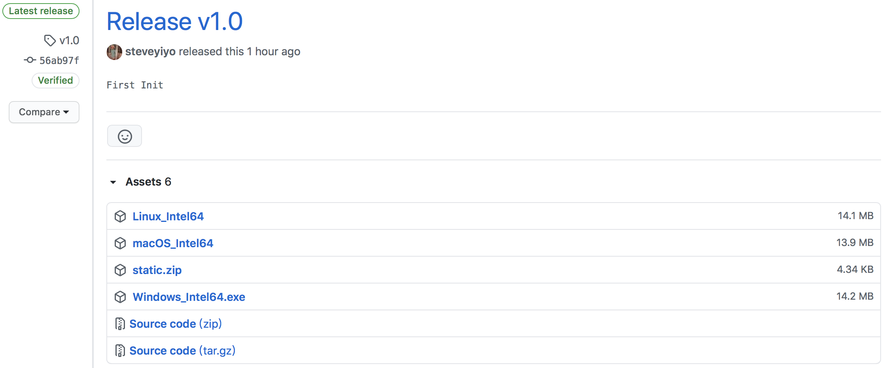

# Simple Login 登入系統

### [查看中文說明文件](Readme_zh.md)

A simple login system.

### How to use?

1. Download the compiled binary file and “static.zip" files from [Release Page](releases).



2. Unzip the zip file as folder and move binary file in to that folder.

> For Mac users, please go to ["Terminal"](https://support.apple.com/guide/terminal/open-or-quit-terminal-apd5265185d-f365-44cb-8b09-71a064a42125/mac), and type
```sudo chmod 755```, then drag the excutable file (which you just downloaded) in to terminal.
This may require your admin password.
Type it and you can't see it.  When you done, just press Return.


3. Excute It!
> For Mac users, you may need to press "⌃ (control)", then press open

**Note: You can edit Files in the static folder**
