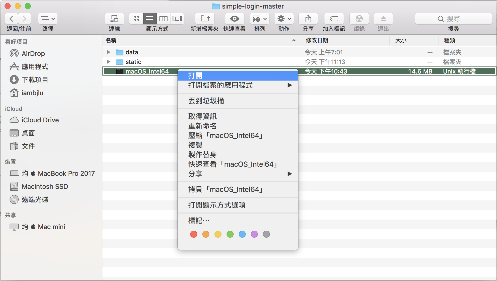

# Simple Login 登入系統

### [English](READMD.md)

一個可以登入的系統。

### 如何使用？

1. 從 [ Release 頁面](releases)下載打包好的可執行檔案和 “static.zip" 。


2. 把壓縮檔解壓縮為資料夾並把可執行檔移進去那個資料夾。

> 如果是 Mac 使用者，請打開 ["終端機"](https://support.apple.com/zh-tw/guide/terminal/apd5265185d-f365-44cb-8b09-71a064a42125/mac)， 然後輸入
```sudo chmod 755```， 再把剛剛下載的可執行檔拖入終端機。
這會要求管理員密碼，打完按下 Return 。打密碼過程中看不到密碼很正常。


4. 執行它!
> 如果是 Mac 使用者， 您可能會需要按著 "⌃ (control)"， 接著再打開它



**備註: 您可以在 static 資料夾編輯檔案**
